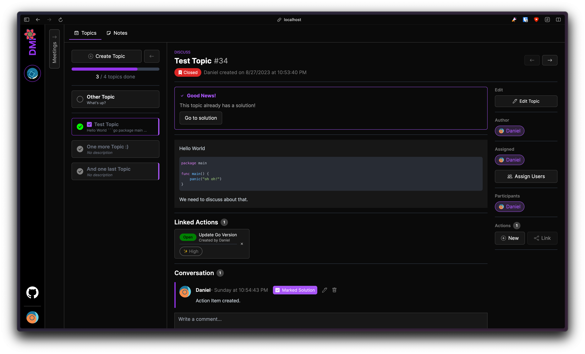

# Perplex

Perplex is a web service designed to help you effectively manage meeting topics and collaborate with your team. 
It acts as a meeting minutes tool, allowing you to create and track meeting topics, record action items, 
and facilitate collaboration among participants.

> [!NOTE]
> This project is currently developed and maintained for personal purposes which is reflected in the limited feature set. 
> It is provided as-is without any warranty or guarantee of its suitability for any specific use case. 

## Installation

Installation Docs Coming Soon! But you will need to have a Google Firebase account & -project and the following installed:

* [Node.js](https://nodejs.org/en/)
* [Go](https://golang.org/)

## Main Features

- **Meeting Topic Management**: DMP provides an easy-to-use interface for creating and managing meeting topics for moderators. You can create, update, and delete topics, add descriptions, and assign relevant details such as meeting date.

- **Action Item Tracking**: Keep track of action items assigned during meetings. DMP allows you to assign action items to specific team members, set deadlines, and monitor progress.

- **Collaboration and Communication**: Foster collaboration and improve communication within your team. DMP allows participants to comment on meeting topics, brainstorm ideas, and provide feedback.

## Contributing

Thank you for considering contributing to DMP! If you have any ideas, suggestions, or found a bug, please open an issue or submit a pull request.

## Contact

If you have any questions or need further assistance, feel free to contact me at [`asdf@qwer.tz`](mailto:asdf@qwer.tz) 🙂
