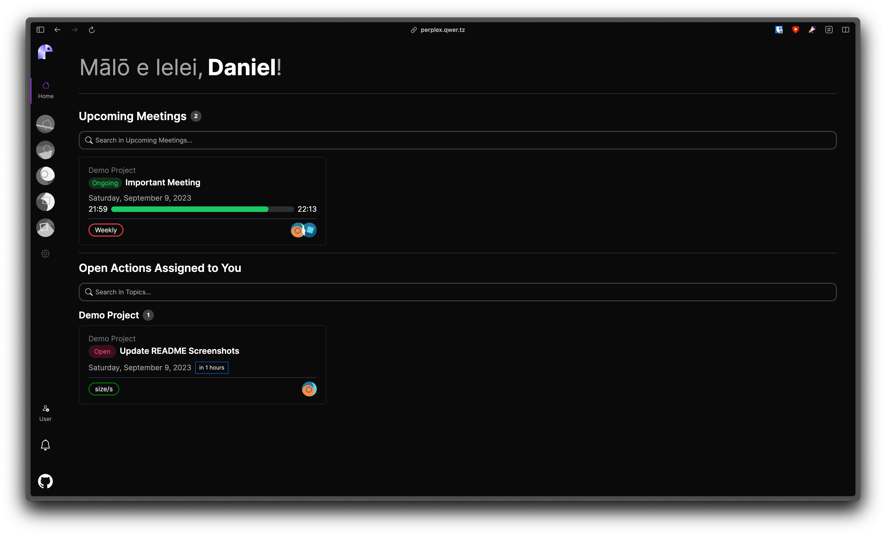
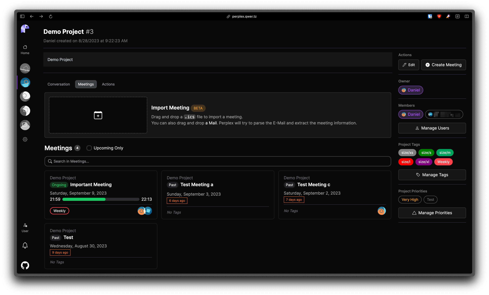
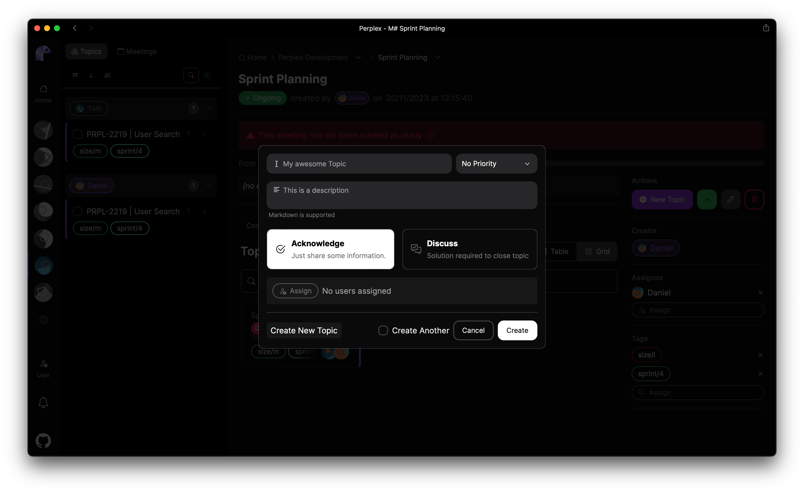
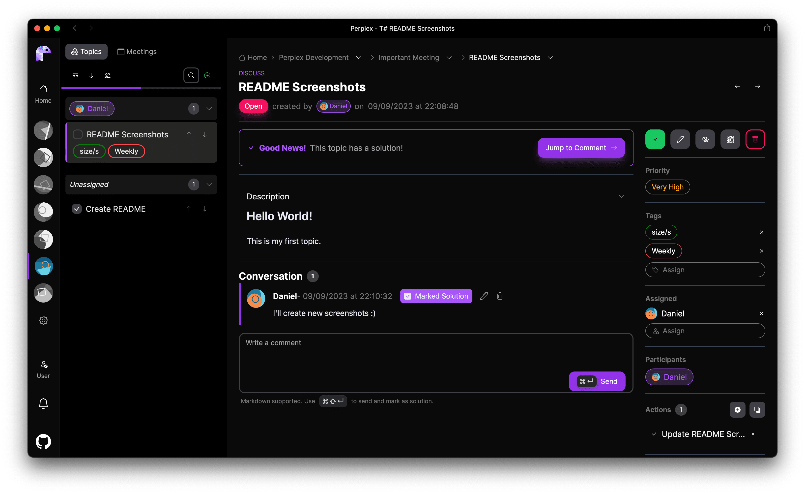

# Perplex

Perplex is a web service designed to help you effectively manage meeting topics and collaborate with your team.
It acts as a meeting minutes tool, allowing you to create and track meeting topics and record action items.
You can also use it to brainstorm ideas and provide feedback. You can take a look at the [screenshots](#screenshots) below to get an idea of what it looks like and what it can do.

> [!NOTE]
> This project is currently developed and maintained for personal purposes which is reflected in the limited feature set.
> It is provided as-is without any warranty or guarantee of its suitability for any specific use case.

## Screenshots

  
Click to expand Screenshots

**Note:** These screenshots may not reflect the current state of the project.

### Dashboard

### Project Overview

### Create Topic

### Topic Overview

## Installation

Installation / Dev-Setup documentation coming soon™!
But I am using [Firebase](https://firebase.google.com/) for authentication,
so you will need to create a Firebase project and have the following installed on your machine:

- [Node.js](https://nodejs.org/en/)
- [Go](https://golang.org/)

## Main Features

- **Meeting Topic Management**: Perplex provides an easy-to-use interface for creating and managing meeting topics for moderators. You can create, update, and delete topics, add descriptions, and assign relevant details such as meeting date.

- **Action Item Tracking**: Keep track of action items assigned during meetings. Perplex allows you to assign action items to specific team members, set deadlines, and monitor progress.

- **Collaboration and Communication**: Foster collaboration and improve communication within your team. Perplex allows participants to comment on meeting topics, brainstorm ideas, and provide feedback.

- **Ab-so-lute-ly Not Reponsive**: Perplex is currently not responsive at all. It is designed to be used on a large screen. Don't even try to use it on a mobile device. (I'm working on it (maybe)!)

## Contributing

Thank you for considering contributing to Perplex! If you have any ideas, suggestions, or found a bug, please open an issue or submit a pull request. I'm always happy to hear from you! 😊
